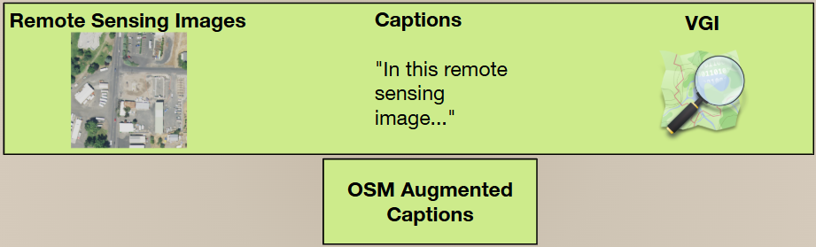
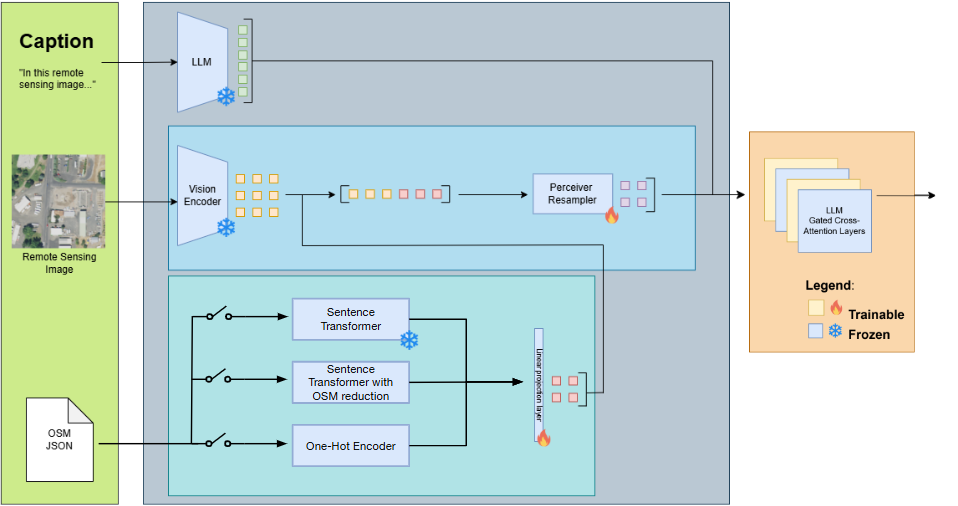
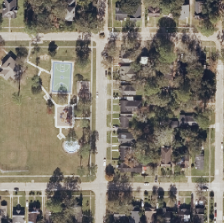

# Exploring OpenStreetMap Data for Enriched Remote Sensing Image Captioning

This project explores using Volunteered Geographic Information (VGI) from OpenStreetMap (OSM) to create more detailed captions for remote sensing images.

## Abstract

This work investigates the potential of integrating VGI from OpenStreetMap to generate more detailed and contextually relevant captions for remote sensing images. The study introduces a custom dataset that combines images, OSM data, and detailed captions. A model inspired by state-of-the-art multi-modal architectures is built, trained, and tested, using a Perceiver Resampler and Gated Cross-Attention layers to merge visual and OSM data during caption generation. The text generation component employs a pre-trained GPT-2 architecture.

The research also addresses challenges related to the variability in VGI data by designing and experimenting with a similarity measure to select the most relevant OSM data for each image. A one-hot encoding strategy is also explored to provide a more structured data representation.

While quantitative results showed limited performance differences, qualitative analyses highlighted the model's ability to generate insightful captions. The study revealed challenges such as data biases, variability, and overfitting, which led to inaccuracies in generated captions. The findings underscore the need for improvements in both dataset quality and model design for future research.

## Dataset

A novel dataset was created for this work, combining remote sensing images, detailed captions, and metadata from OpenStreetMap. This dataset was built using images from the NAIP program in the US, due to the extensive and frequently updated OSM data in the region. The dataset consists of 1568 samples.

Two versions of captions were created:

- General Captions: These were manually annotated with details that can be inferred from the visual content alone.
- Augmented Captions: These captions enrich the general captions with details from the OSM data, such as the names of places, the purpose of a facility, or other information not easily visible in the image.

## Model Architecture

The proposed model is a multi-modal architecture that integrates visual information from remote sensing images along textual information and data from OSM.

- **Encoder**: The model uses the visual backbone of pre-trained CLIP or RemoteCLIP models to extract meaningful image embeddings.
- **Decoder**: A pre-trained GPT-2 architecture is used for text generation.
- **Cross-Modal Interaction**: A Perceiver Resampler and interleaved Gated Cross-Attention layers are used to merge the visual and OSM information before it is passed to the LLM.

The complete multi-modal architecture during training is shown below. This architecture details how visual and OSM data are integrated, with various flags available for processing the content in different ways to generate captions.

## Experiments

Experiments were conducted using two datasets: the UCM dataset (images and text only) and the custom OSM dataset. The model's performance was evaluated using standard metrics such as BLEU.

|  | A neighborhood with several houses arranged in a grid pattern around a central road. In the top left corner, there is a large building with a brown roof, surrounded by trees. In the bottom right, a small building with a white roof is surrounded by parked cars. |
| ------------------------------------------------ | -------------------------------------------------------------------------------------------------------------------------------------------------------------------------------------------------------------------------------------------------------------------- |

_Example of one experiment's generated captions. While it provides a relatively detailed description, it misses key information and also hallucinates several elements._

Key findings from the experiments include:

- The model showed an ability to generate insightful captions.
- The VGI data needs to be more refined and highlights the need for a more robust method of selecting and filtering relevant OSM data. Yet in some experiments OSM details were included on the generated captions not included on the original captions.
- Overfitting was a significant challenge due to the limited number of labeled samples.
- The Perceiver Resampler and Gated Cross-Attention layers were efficient in enabling the model to learn high-quality relationships between the image and smaller captions, as proven by the UCM dataset, but the OSM data needs to be further refined to improve its integration.
